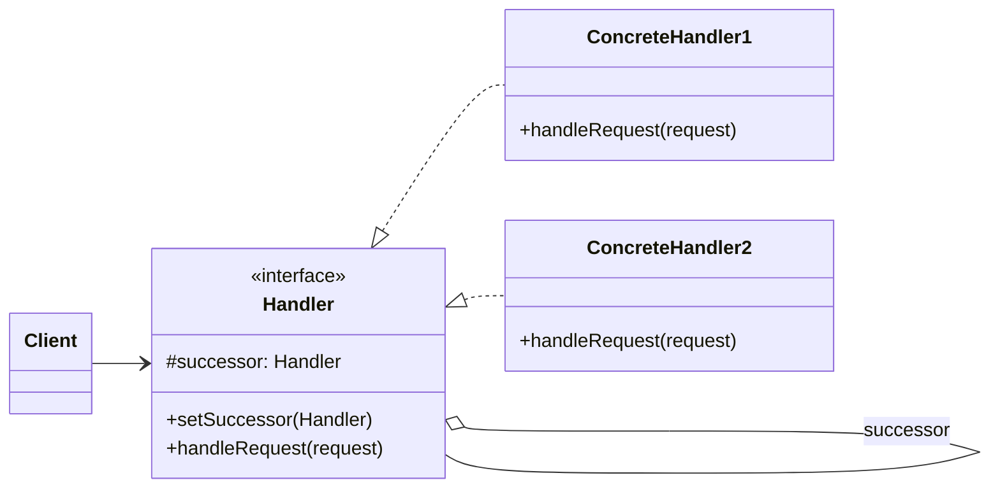

### 设计模式意图

**责任链模式 (Chain of Responsibility Pattern)** 为请求创建了一个接收者对象的链。这种模式使得请求的发送者和接收者解耦，请求沿着链传递，直到链上的某个处理者处理它为止。

### 类和方法解释

*   **`Client` (客户端)**
    *   作用：创建请求并将其发送到责任链的第一个处理者 (`Handler`)。客户端不需要知道哪个处理者会处理该请求。
*   **`Handler` (处理者)**
    *   角色：接口 (`<<interface>>`) 或抽象类。
    *   作用：定义了处理请求的接口，并维护一个对下一个处理者 (`successor`) 的引用。
    *   `#successor: Handler`: 指向链中的下一个 `Handler` 对象。
    *   `setSuccessor(Handler)`: 设置下一个处理者。
    *   `handleRequest(request)`: 接收并处理请求的抽象方法。
*   **`ConcreteHandler1` / `ConcreteHandler2` (具体处理者)**
    *   作用：实现了 `Handler` 接口。每个具体处理者都决定两个问题：它是否能处理这个请求，以及是否将请求沿着链传递下去。
    *   `handleRequest(request)`: 实现具体的处理逻辑。如果它能处理该请求，就处理它；否则，它会将请求转发给它的后继者 (`successor.handleRequest(request)`)。

### 关系解释

*   **`Handler <|.. ConcreteHandler1`** 和 **`Handler <|.. ConcreteHandler2`**:
    *   关系：**实现 (Realization)** 或 **继承 (Generalization)**。
    *   解释：`ConcreteHandler1` 和 `ConcreteHandler2` 是 `Handler` 接口或抽象类的具体实现。
*   **`Handler o-- Handler : successor`**:
    *   关系：**聚合 (Aggregation)**，表示自我关联。
    *   解释：每个 `Handler` 对象都持有一个对另一个 `Handler` 对象的引用（即 `successor`）。这个引用将处理者们连接成一条链。
*   **`Client --> Handler`**:
    *   关系：**关联 (Association)**。
    *   解释：客户端只需要与链的起始 `Handler` 进行交互。它将请求发送给第一个处理者，然后请求会在链中自动传递，直到被处理或到达链的末端。