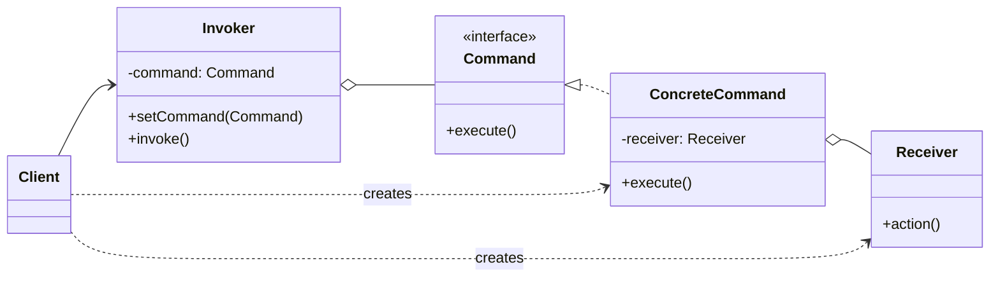

### 设计模式意图

**命令模式 (Command Pattern)** 将一个请求封装为一个对象，从而允许你使用不同的请求、队列或日志来参数化客户端；命令模式还支持可撤销的操作。它将请求的发送者（`Invoker`）与接收者（`Receiver`）完全解耦。

### 类和方法解释

*   **`Client` (客户端)**
    *   作用：创建 `ConcreteCommand` 对象，并设置其接收者 `Receiver`。然后，它将这个命令对象配置给 `Invoker`。
*   **`Command` (命令)**
    *   角色：接口 (`<<interface>>`)。
    *   作用：声明了一个执行操作的接口。
    *   `execute()`: 执行命令的统一方法。
*   **`ConcreteCommand` (具体命令)**
    *   作用：实现了 `Command` 接口。它持有一个 `Receiver` 对象的引用，并在 `execute()` 方法中调用 `Receiver` 的相应 `action()` 方法。
    *   `-receiver: Receiver`: 命令的接收者。
*   **`Receiver` (接收者)**
    *   作用：知道如何执行与请求相关的操作。它是真正执行业务逻辑的类。
    *   `action()`: 具体的业务逻辑方法。
*   **`Invoker` (调用者)**
    *   作用：要求命令执行一个请求。它持有一个 `Command` 对象，但不关心命令的具体实现，只调用其 `execute()` 方法。
    *   `setCommand(Command)`: 设置要执行的命令。
    *   `invoke()`: 调用命令的 `execute()` 方法，从而触发 `Receiver` 的 `action`。

### 关系解释

*   **`Command <|.. ConcreteCommand`**:
    *   关系：**实现 (Realization)**。
    *   解释：`ConcreteCommand` 是 `Command` 接口的具体实现。
*   **`ConcreteCommand o-- Receiver`**:
    *   关系：**聚合 (Aggregation)** 或 **关联 (Association)**。
    *   解释：`ConcreteCommand` 对象内部包含一个对 `Receiver` 对象的引用，以便在 `execute` 时调用其方法。
*   **`Invoker o-- Command`**:
    *   关系：**聚合 (Aggregation)** 或 **关联 (Association)**。
    *   解释：`Invoker` 持有一个 `Command` 对象的引用。它通过这个抽象接口来发起请求，从而与 `Receiver` 解耦。
*   **`Client ..> ConcreteCommand : creates`** 和 **`Client ..> Receiver : creates`**:
    *   关系：**依赖 (Dependency)**，表示创建关系。
    *   解释：客户端负责创建和组装 `ConcreteCommand` 和 `Receiver`。
*   **`Client --> Invoker`**:
    *   关系：**关联 (Association)**。
    *   解释：客户端与 `Invoker` 交互，将配置好的命令交给它执行。