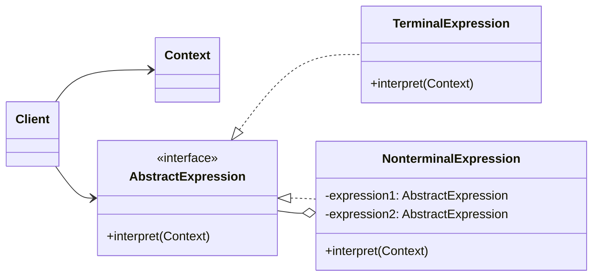

### 设计模式意图

**解释器模式 (Interpreter Pattern)** 给定一种语言，定义它的文法的一种表示，并定义一个解释器，这个解释器使用该表示来解释语言中的句子。它主要用于构建简单的语言解释器，如 SQL 解析、符号处理引擎等。

### 类和方法解释

*   **`Client` (客户端)**
    *   作用：构建（或解析）一个代表特定句子的抽象语法树（AST），并调用解释操作。
*   **`Context` (上下文)**
    *   作用：包含解释器之外的全局信息。在解释过程中，解释器可能需要从 `Context` 中存取信息。
*   **`AbstractExpression` (抽象表达式)**
    *   角色：接口 (`<<interface>>`) 或抽象类。
    *   作用：为抽象语法树中的所有节点（终结符和非终结符）声明一个统一的 `interpret` 操作接口。
    *   `interpret(Context)`: 核心解释方法，接收一个上下文对象作为参数。
*   **`TerminalExpression` (终结符表达式)**
    *   作用：实现了 `AbstractExpression` 接口，代表文法中的终结符（基本元素，不可再分）。它实现了与文法规则中终结符相关的解释操作。
*   **`NonterminalExpression` (非终结符表达式)**
    *   作用：实现了 `AbstractExpression` 接口，代表文法中的非终结符（组合元素）。它通常包含对其他 `AbstractExpression` 的引用（递归结构）。
    *   `interpret(Context)`: 它的解释操作通常是递归地调用它所包含的子表达式的 `interpret` 方法。

### 关系解释

*   **`AbstractExpression <|.. TerminalExpression`** 和 **`AbstractExpression <|.. NonterminalExpression`**:
    *   关系：**实现 (Realization)** 或 **继承 (Generalization)**。
    *   解释：`TerminalExpression` 和 `NonterminalExpression` 都是 `AbstractExpression` 的具体实现，它们共同构成了抽象语法树的节点。
*   **`NonterminalExpression o-- AbstractExpression`**:
    *   关系：**聚合 (Aggregation)** 或 **组合 (Composition)**，表示递归组合。
    *   解释：`NonterminalExpression` 包含一个或多个 `AbstractExpression` 类型的子节点。这些子节点既可以是 `TerminalExpression`，也可以是其他的 `NonterminalExpression`，从而形成树形结构。
*   **`Client --> Context`** 和 **`Client --> AbstractExpression`**:
    *   关系：**关联 (Association)**。
    *   解释：客户端负责构建抽象语法树，并调用根节点的 `interpret` 方法来启动整个解释过程。客户端也可能需要创建和配置 `Context` 对象。