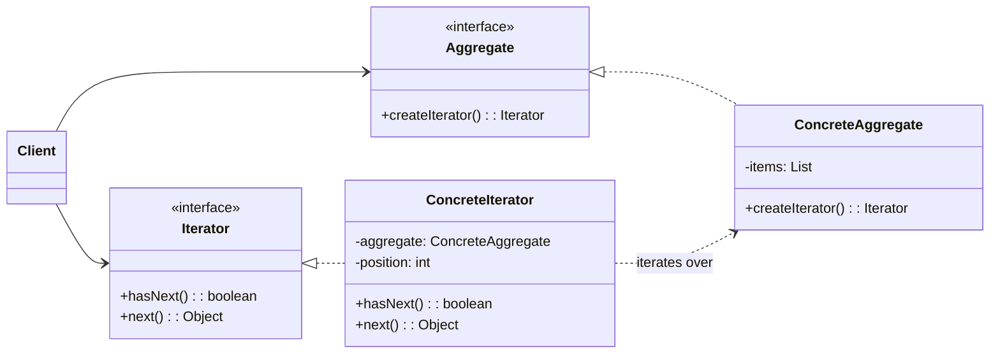

### 设计模式意图

**迭代器模式 (Iterator Pattern)** 提供一种方法来顺序访问一个聚合对象（集合）中的各个元素，而又不暴露该对象的内部表示。它将遍历集合的责任从集合本身分离出来，移入到一个独立的迭代器对象中。

### 类和方法解释

*   **`Client` (客户端)**
    *   作用：需要遍历一个集合。它通过 `Aggregate` 接口获取一个 `Iterator` 对象，然后使用 `Iterator` 的接口来遍历元素，无需关心集合的具体类型和内部结构。
*   **`Aggregate` (聚合)**
    *   角色：接口 (`<<interface>>`)。
    *   作用：定义了创建迭代器对象的接口。
    *   `createIterator(): Iterator`: 工厂方法，用于创建一个与该聚合对象相对应的迭代器。
*   **`ConcreteAggregate` (具体聚合)**
    *   作用：实现了 `Aggregate` 接口，是客户端需要遍历的具体集合类。它负责实例化一个具体的迭代器 `ConcreteIterator`。
    *   `-items: List`: 内部存储元素的集合。
*   **`Iterator` (迭代器)**
    *   角色：接口 (`<<interface>>`)。
    *   作用：定义了遍历元素所需的通用接口。
    *   `hasNext(): boolean`: 检查是否还有下一个元素。
    *   `next(): Object`: 返回下一个元素，并将迭代器位置后移。
*   **`ConcreteIterator` (具体迭代器)**
    *   作用：实现了 `Iterator` 接口，负责对特定的 `ConcreteAggregate` 进行遍历。它内部维护着遍历的状态，如当前位置 (`position`)。
    *   `-aggregate: ConcreteAggregate`: 持有对其所遍历的聚合对象的引用。

### 关系解释

*   **`Aggregate <|.. ConcreteAggregate`**:
    *   关系：**实现 (Realization)**。
    *   解释：`ConcreteAggregate` 是 `Aggregate` 接口的具体实现。
*   **`Iterator <|.. ConcreteIterator`**:
    *   关系：**实现 (Realization)**。
    *   解释：`ConcreteIterator` 是 `Iterator` 接口的具体实现。
*   **`ConcreteIterator ..> ConcreteAggregate : iterates over`**:
    *   关系：**依赖 (Dependency)**，表示 "iterates over"（遍历）的关系。
    *   解释：`ConcreteIterator` 需要访问 `ConcreteAggregate` 的内部元素才能完成遍历。通常 `ConcreteAggregate` 会将 `ConcreteIterator` 作为内部类或友元类，以允许这种访问。
*   **`Client --> Aggregate`** 和 **`Client --> Iterator`**:
    *   关系：**关联 (Association)**。
    *   解释：客户端依赖于 `Aggregate` 和 `Iterator` 的抽象接口，而不是它们的具体实现。这使得客户端可以与任何实现了这些接口的集合和迭代器一起工作。