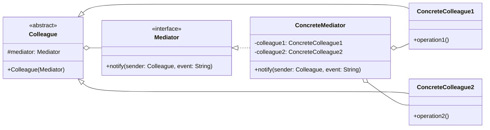

### 设计模式意图

**中介者模式 (Mediator Pattern)** 用一个中介对象来封装一系列的对象交互。中介者使各对象不需要显式地相互引用，从而使其耦合松散，而且可以独立地改变它们之间的交互。它将多对多的网状交互结构转变为一对多的星形结构。

### 类和方法解释

*   **`Mediator` (中介者)**
    *   角色：接口 (`<<interface>>`)。
    *   作用：定义了与各个 `Colleague` 对象通信的接口。
    *   `notify(sender: Colleague, event: String)`: `Colleague` 对象通过这个方法通知 `Mediator` 发生了某个事件，`Mediator` 再根据事件协调其他 `Colleague`。
*   **`ConcreteMediator` (具体中介者)**
    *   作用：实现了 `Mediator` 接口，负责协调各个 `Colleague` 对象的行为。它了解并维护所有的 `Colleague`。
    *   `-colleague1`, `-colleague2`: 持有对所有 `Colleague` 对象的引用。
*   **`Colleague` (同事)**
    *   角色：抽象类 (`<<abstract>>`)。
    *   作用：定义了同事类的通用接口，并持有一个对 `Mediator` 对象的引用。
    *   `#mediator: Mediator`: 指向中介者对象。
*   **`ConcreteColleague1` / `ConcreteColleague2` (具体同事)**
    *   作用：实现了 `Colleague` 的接口。每个 `Colleague` 只知道自己的 `Mediator`，但不知道其他 `Colleague`。当自身状态改变需要通知其他同事时，它会通知 `Mediator`。

### 关系解释

*   **`Mediator <|.. ConcreteMediator`**:
    *   关系：**实现 (Realization)**。
    *   解释：`ConcreteMediator` 是 `Mediator` 接口的具体实现。
*   **`Colleague <|-- ConcreteColleague1`** 和 **`Colleague <|-- ConcreteColleague2`**:
    *   关系：**继承/泛化 (Generalization)**。
    *   解释：具体的同事类继承自抽象的 `Colleague` 类。
*   **`ConcreteMediator o-- ConcreteColleague1`** (等):
    *   关系：**聚合 (Aggregation)** 或 **关联 (Association)**。
    *   解释：`ConcreteMediator` 了解并维护所有的 `ConcreteColleague` 实例，以便在它们之间进行协调。
*   **`Colleague o-- Mediator`**:
    *   关系：**聚合 (Aggregation)** 或 **关联 (Association)**。
    *   解释：每个 `Colleague` 对象都持有一个对 `Mediator` 的引用。当 `Colleague` 需要与其他同事通信时，它会通过这个引用通知中介者。
