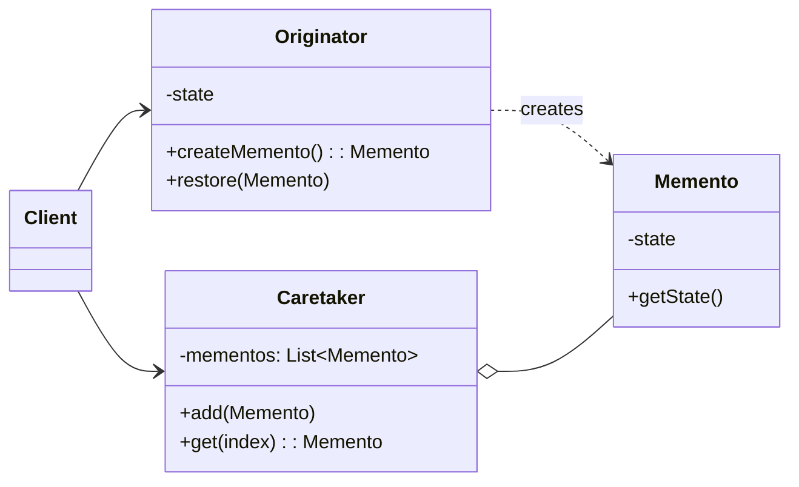

### 设计模式意图

**备忘录模式 (Memento Pattern)** 在不破坏封装性的前提下，捕获一个对象的内部状态，并在该对象之外保存这个状态。这样以后就可将该对象恢复到原先保存的状态。它常用于实现撤销（Undo）功能。

### 类和方法解释

*   **`Client` (客户端)**
    *   作用：触发 `Originator` 状态的改变，并决定何时创建备忘录以及何时从备忘录中恢复 `Originator` 的状态。
*   **`Originator` (发起人)**
    *   作用：是需要被保存状态的那个对象。
    *   `-state`: 对象的内部状态。
    *   `createMemento(): Memento`: 创建一个包含当前内部状态快照的 `Memento` 对象。
    *   `restore(Memento)`: 使用一个 `Memento` 对象来恢复自己的内部状态。
*   **`Memento` (备忘录)**
    *   作用：负责存储 `Originator` 对象的内部状态。为了保护封装性，`Memento` 通常会阻止除 `Originator` 之外的任何其他对象访问其内部状态。
    *   `-state`: 存储的状态。
    *   `getState()`: 一个获取状态的方法，其可见性通常被限制，只有 `Originator` 可以访问。
*   **`Caretaker` (负责人)**
    *   作用：负责保存 `Memento` 对象，但它不能操作或检查 `Memento` 的内容。它只负责存储，像一个仓库管理员。
    *   `-mementos: List<Memento>`: 用于存储历史备忘录的列表。
    *   `add(Memento)`: 添加一个备忘录。
    *   `get(index): Memento`: 获取一个历史备忘录。

### 关系解释

*   **`Originator ..> Memento : creates`**:
    *   关系：**依赖 (Dependency)**，表示创建关系。
    *   解释：`Originator` 负责创建 `Memento` 对象来存储其状态。`Originator` 也可以访问 `Memento` 的内部，以便恢复状态。
*   **`Caretaker o-- Memento`**:
    *   关系：**聚合 (Aggregation)**。
    *   解释：`Caretaker` 持有并管理一个或多个 `Memento` 对象。但它将 `Memento` 视为一个黑盒，不关心其内部细节。
*   **`Client --> Originator`** 和 **`Client --> Caretaker`**:
    *   关系：**关联 (Association)**。
    *   解释：客户端与 `Originator` 交互以改变其状态，并与 `Caretaker` 交互来请求保存（通过 `Originator` 创建 `Memento` 并交给 `Caretaker`）或恢复（从 `Caretaker` 获取 `Memento` 并交给 `Originator`）状态。