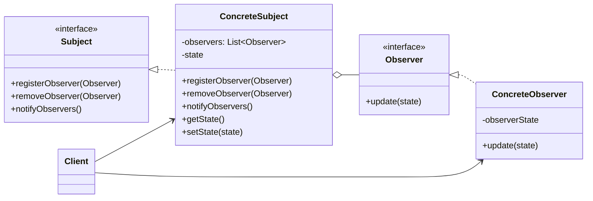

### 设计模式意图

**观察者模式 (Observer Pattern)** 定义了对象之间一种一对多的依赖关系，当一个对象（主题）的状态发生改变时，所有依赖于它的对象（观察者）都将得到通知并自动更新。它也被称为发布-订阅（Publish-Subscribe）模式。

### 类和方法解释

*   **`Client` (客户端)**
    *   作用：创建 `ConcreteSubject` 和 `ConcreteObserver` 对象，并将观察者注册到主题中。
*   **`Subject` (主题)**
    *   角色：接口 (`<<interface>>`)。
    *   作用：提供了用于附加、分离和通知观察者的接口。
    *   `registerObserver(Observer)`: 注册一个观察者。
    *   `removeObserver(Observer)`: 移除一个观察者。
    *   `notifyObservers()`: 当自身状态改变时，通知所有已注册的观察者。
*   **`ConcreteSubject` (具体主题)**
    *   作用：实现了 `Subject` 接口，维护自身的状态以及一个观察者列表。
    *   `-observers: List<Observer>`: 存储已注册的观察者。
    *   `-state`: 主题的状态。
    *   `setState(state)`: 当调用此方法改变状态时，会触发 `notifyObservers()`。
    *   `getState()`: 获取当前状态。
*   **`Observer` (观察者)**
    *   角色：接口 (`<<interface>>`)。
    *   作用：定义了一个更新接口，当接收到主题的通知时，该接口被调用。
    *   `update(state)`: 主题通过调用此方法将状态变更通知给观察者。
*   **`ConcreteObserver` (具体观察者)**
    *   作用：实现了 `Observer` 接口。它维护着与主题状态同步所需的状态 (`observerState`)。当 `update` 方法被调用时，它会更新自身状态。

### 关系解释

*   **`Subject <|.. ConcreteSubject`**:
    *   关系：**实现 (Realization)**。
    *   解释：`ConcreteSubject` 是 `Subject` 接口的具体实现。
*   **`Observer <|.. ConcreteObserver`**:
    *   关系：**实现 (Realization)**。
    *   解释：`ConcreteObserver` 是 `Observer` 接口的具体实现。
*   **`ConcreteSubject o-- Observer`**:
    *   关系：**聚合 (Aggregation)**。
    *   解释：`ConcreteSubject` 内部持有一个 `Observer` 对象的集合。这构成了一对多的关系：一个主题可以有多个观察者。
*   **`Client --> ConcreteSubject`** 和 **`Client --> ConcreteObserver`**:
    *   关系：**关联 (Association)**。
    *   解释：客户端负责创建和组装主题与观察者，建立它们之间的订阅关系。