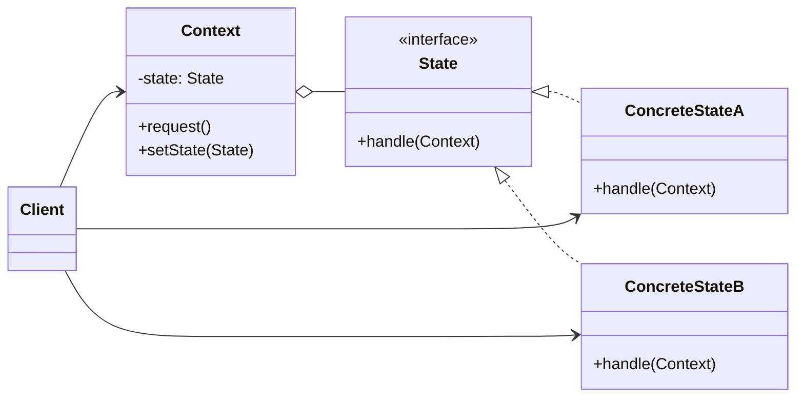

### 设计模式意图

**状态模式 (State Pattern)** 允许一个对象在其内部状态改变时改变它的行为。对象看起来似乎修改了它的类。该模式将与特定状态相关的行为局部化，并将不同状态的行为分割开来。

### 类和方法解释

*   **`Client` (客户端)**
    *   作用：与 `Context` 对象交互。客户端不需要知道 `Context` 的内部状态，只需调用其 `request` 方法。
*   **`Context` (上下文)**
    *   作用：维护一个 `State` 子类的实例，这个实例定义了对象的当前状态。它将所有与状态相关的请求委托给当前的状态对象。
    *   `-state: State`: 持有当前的状态对象。
    *   `request()`: `Context` 的核心方法，其行为会根据当前 `state` 对象而改变。它通常会调用 `state.handle(this)`。
    *   `setState(State)`: 用于改变当前的状态。
*   **`State` (状态)**
    *   角色：接口 (`<<interface>>`) 或抽象类。
    *   作用：定义了一个接口，用于封装与 `Context` 的一个特定状态相关的行为。
    *   `handle(Context)`: 封装了在该状态下要执行的操作，并且可以决定在何种条件下转换到下一个状态。
*   **`ConcreteStateA` / `ConcreteStateB` (具体状态)**
    *   作用：实现了 `State` 接口，代表 `Context` 的不同状态。每个具体状态类都实现了在该状态下 `Context` 的行为。
    *   `handle(Context)`: 实现具体的业务逻辑。在处理完后，它可能会调用 `context.setState()` 将 `Context` 转换到一个新的状态。

### 关系解释

*   **`State <|.. ConcreteStateA`** 和 **`State <|.. ConcreteStateB`**:
    *   关系：**实现 (Realization)** 或 **继承 (Generalization)**。
    *   解释：`ConcreteStateA` 和 `ConcreteStateB` 是 `State` 接口或抽象类的具体实现，代表了不同的状态。
*   **`Context o-- State`**:
    *   关系：**聚合 (Aggregation)** 或 **组合 (Composition)**。
    *   解释：`Context` 对象包含一个对 `State` 对象的引用。`Context` 的行为是通过委托给这个 `State` 对象来实现的。这是状态模式的核心。
*   **`Client --> Context`**:
    *   关系：**关联 (Association)**。
    *   解释：客户端只与 `Context` 对象交互。`Context` 内部的状态转换对客户端是透明的。
*   **`Client --> ConcreteStateA`** (等):
    *   关系：**关联 (Association)** 或 **依赖 (Dependency)**。
    *   解释：客户端通常负责创建 `Context` 对象并为其设置初始状态，因此可能需要与具体状态类交互。