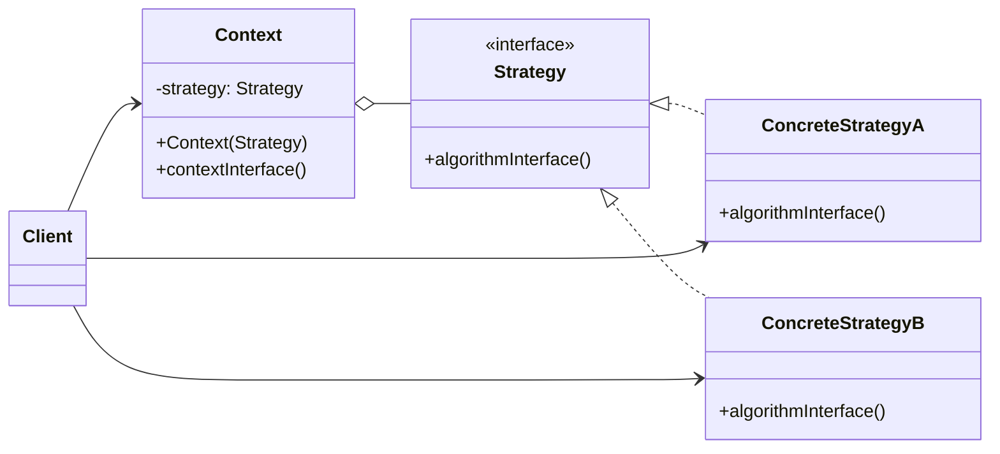

### 设计模式意图

**策略模式 (Strategy Pattern)** 定义了一系列算法，并将每一个算法封装起来，使它们可以相互替换。策略模式让算法的变化独立于使用算法的客户端。

### 类和方法解释

*   **`Client` (客户端)**
    *   作用：创建一个具体的 `Strategy` 对象，并将其传递给 `Context` 对象。客户端决定在运行时使用哪种策略。
*   **`Context` (上下文)**
    *   作用：维护一个对 `Strategy` 对象的引用。它不实现任何具体的算法，而是将算法的执行委托给其持有的 `Strategy` 对象。
    *   `-strategy: Strategy`: 持有当前选择的策略对象。
    *   `Context(Strategy)`: 构造函数，用于注入一个初始策略。
    *   `contextInterface()`: `Context` 提供给客户端调用的方法。它内部会调用 `strategy.algorithmInterface()`。
*   **`Strategy` (策略)**
    *   角色：接口 (`<<interface>>`)。
    *   作用：为所有支持的算法声明一个公共接口。`Context` 使用这个接口来调用由 `ConcreteStrategy` 定义的算法。
    *   `algorithmInterface()`: 算法的统一接口。
*   **`ConcreteStrategyA` / `ConcreteStrategyB` (具体策略)**
    *   作用：实现了 `Strategy` 接口，封装了具体的算法或行为。

### 关系解释

*   **`Strategy <|.. ConcreteStrategyA`** 和 **`Strategy <|.. ConcreteStrategyB`**:
    *   关系：**实现 (Realization)**。
    *   解释：`ConcreteStrategyA` 和 `ConcreteStrategyB` 是 `Strategy` 接口的具体实现，它们提供了不同的算法。
*   **`Context o-- Strategy`**:
    *   关系：**聚合 (Aggregation)** 或 **组合 (Composition)**。
    *   解释：`Context` 对象包含一个对 `Strategy` 对象的引用。`Context` 的行为是通过委托给这个 `Strategy` 对象来实现的。这是策略模式的核心。
*   **`Client --> Context`**:
    *   关系：**关联 (Association)**。
    *   解释：客户端与 `Context` 交互，并通过 `Context` 来执行某个算法。
*   **`Client --> ConcreteStrategyA`** (等):
    *   关系：**关联 (Association)** 或 **依赖 (Dependency)**。
    *   解释：客户端负责创建并选择一个具体的策略 `ConcreteStrategy`，然后将其设置到 `Context` 中。