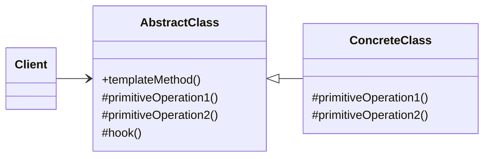

### 设计模式意圖

**模板方法模式 (Template Method Pattern)** 在一个方法中定义一个算法的骨架，而将一些步骤延迟到子类中实现。模板方法使得子类可以不改变一个算法的结构即可重定义该算法的某些特定步骤。

### 类和方法解释

*   **`Client` (客户端)**
    *   作用：与 `AbstractClass` 的子类 `ConcreteClass` 进行交互。客户端调用 `templateMethod()` 来执行整个算法，而不需要关心算法内部的具体步骤。
*   **`AbstractClass` (抽象类)**
    *   作用：定义了算法的骨架（模板方法），并声明了子类需要实现的抽象步骤。
    *   `+templateMethod()`: 模板方法。它是一个具体方法，定义了算法的执行顺序，并调用一系列基本操作。此方法通常被声明为 `final` 以防止子类覆盖。
    *   `#primitiveOperation1()`, `#primitiveOperation2()`: 抽象的“基本操作”。这些是算法中的可变部分，由子类 `ConcreteClass` 来具体实现。
    *   `#hook()`: “钩子”方法。这是一个在 `AbstractClass` 中提供了默认实现（通常是空实现）的具体方法。子类可以选择性地覆盖它，以在算法的特定步骤插入自定义逻辑。
*   **`ConcreteClass` (具体类)**
    *   作用：继承自 `AbstractClass`，并为父类中声明的抽象基本操作（`primitiveOperation`）提供具体实现。它也可以选择性地覆盖钩子方法 (`hook`)。

### 关系解释

*   **`AbstractClass <|-- ConcreteClass`**:
    *   关系：**继承/泛化 (Generalization)**。
    *   解释：`ConcreteClass` 继承了 `AbstractClass`。它继承了 `templateMethod` 的结构，并负责实现该结构中缺失的具体步骤。
*   **`Client --> AbstractClass`**:
    *   关系：**关联 (Association)**。
    *   解释：客户端代码依赖于 `AbstractClass` 的抽象接口。它通过父类引用来调用 `templateMethod`，实现了对具体子类的解耦，这符合里氏替换原则。