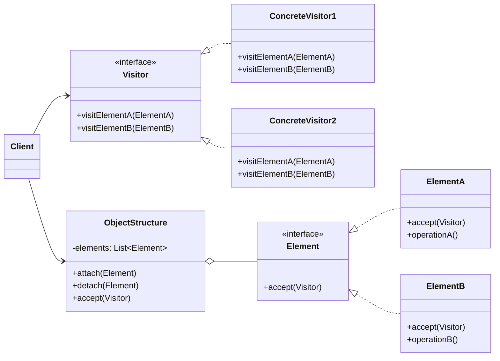

### 设计模式意图

**访问者模式 (Visitor Pattern)** 表示一个作用于某对象结构中的各元素的操作。它使你可以在不改变各元素的类的前提下，定义作用于这些元素的新操作。该模式将数据结构和作用于其上的操作解耦。

### 类和方法解释

*   **`Client` (客户端)**
    *   作用：创建 `ObjectStructure`，并用各种 `Element` 对象填充它。然后创建 `Visitor` 对象，并用它来访问 `ObjectStructure` 中的元素。
*   **`Visitor` (访问者)**
    *   角色：接口 (`<<interface>>`)。
    *   作用：为对象结构中每一种 `Element` 声明一个 `visit` 方法。方法名通常相同，但参数不同（方法重载）。
    *   `visitElementA(ElementA)`: 对 `ElementA` 类型元素的操作。
    *   `visitElementB(ElementB)`: 对 `ElementB` 类型元素的操作。
*   **`ConcreteVisitor1` / `ConcreteVisitor2` (具体访问者)**
    *   作用：实现了 `Visitor` 接口，定义了对每个 `Element` 的具体操作。每个 `ConcreteVisitor` 代表一种不同的操作组合。
*   **`Element` (元素)**
    *   角色：接口 (`<<interface>>`)。
    *   作用：定义了一个 `accept` 方法，它以一个 `Visitor` 作为参数。
    *   `accept(Visitor)`: 接受访问者的方法。
*   **`ElementA` / `ElementB` (具体元素)**
    *   作用：实现了 `Element` 接口。
    *   `accept(Visitor)`: 核心所在，实现了双分派（Double Dispatch）。它的实现通常只有一行：`visitor.visitElementA(this)`。它将自身（`this`）传递给 `Visitor`，从而让 `Visitor` 知道当前访问的元素类型。
    *   `operationA()`: 元素自身特有的业务方法。
*   **`ObjectStructure` (对象结构)**
    *   作用：一个能枚举其元素的集合，如一个组合结构或列表。它提供一个高层接口以允许访问者访问它的元素。
    *   `accept(Visitor)`: 遍历所有元素，并对每个元素调用 `accept` 方法。

### 关系解释

*   **`Visitor <|.. ConcreteVisitor1`** (等):
    *   关系：**实现 (Realization)**。
    *   解释：具体访问者实现了访问者接口。
*   **`Element <|.. ElementA`** (等):
    *   关系：**实现 (Realization)**。
    *   解释：具体元素实现了元素接口。
*   **`ObjectStructure o-- Element`**:
    *   关系：**聚合 (Aggregation)**。
    *   解释：`ObjectStructure` 包含并管理一组 `Element` 对象。
*   **`Client --> ObjectStructure`** 和 **`Client --> Visitor`**:
    *   关系：**关联 (Association)**。
    *   解释：客户端使用 `Visitor` 来对 `ObjectStructure` 中的元素执行操作。