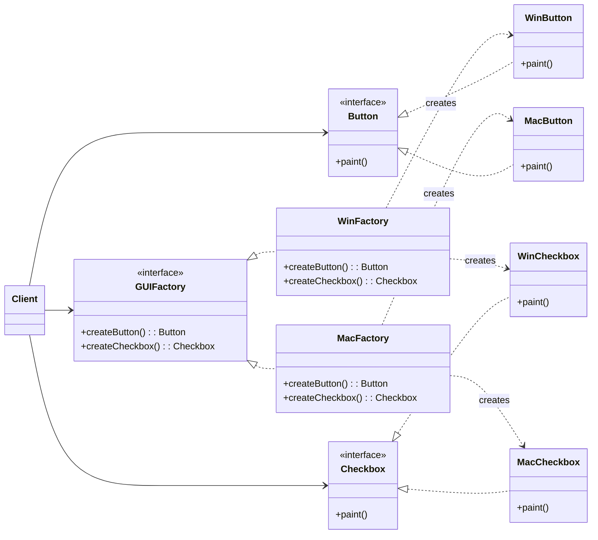

### 设计模式意图

**抽象工厂模式 (Abstract Factory Pattern)** 提供一个接口，用于创建一系列相关或相互依赖的对象，而无需指定它们具体的类。它属于创建型模式，其核心思想是将一组对象的创建封装到一个工厂接口中。

### 类和方法解释

*   **`Client` (客户端)**
    *   作用：需要使用一组特定产品（例如 Windows 风格的按钮和复选框）的类。它不直接实例化具体产品，而是通过抽象工厂 `GUIFactory` 来获取。
*   **`GUIFactory` (抽象工厂)**
    *   角色：接口（`<<interface>>`）。
    *   作用：定义了一组用于创建抽象产品的方法。每个方法对应一个产品。
    *   `createButton(): Button`: 创建一个抽象的 `Button` 产品。
    *   `createCheckbox(): Checkbox`: 创建一个抽象的 `Checkbox` 产品。
*   **`WinFactory` / `MacFactory` (具体工厂)**
    *   作用：实现了 `GUIFactory` 接口，负责创建一整套具体的产品（例如，`WinFactory` 创建 Windows 风格的所有产品）。
*   **`Button` / `Checkbox` (抽象产品)**
    *   角色：接口（`<<interface>>`）。
    *   作用：定义了一类产品的通用接口。
    *   `paint()`: 产品的通用方法，例如在界面上绘制自己。
*   **`WinButton`, `MacButton`, `WinCheckbox`, `MacCheckbox` (具体产品)**
    *   作用：实现了抽象产品的接口，是工厂最终创建出来的对象。它们包含了特定于平台的实现。

### 关系解释

*   **`GUIFactory <|.. WinFactory`** 和 **`GUIFactory <|.. MacFactory`**:
    *   关系：**实现 (Realization)**。
    *   解释：`WinFactory` 和 `MacFactory` 都是 `GUIFactory` 接口的具体实现。这表示它们承诺提供创建按钮和复选框的功能。
*   **`Button <|.. WinButton`** (以此类推):
    *   关系：**实现 (Realization)**。
    *   解释：具体产品（如 `WinButton`）是抽象产品接口（`Button`）的具体实现。
*   **`WinFactory ..> WinButton : creates`**:
    *   关系：**依赖 (Dependency)**，通常表示创建关系。
    *   解释：`WinFactory` 负责创建 `WinButton` 和 `WinCheckbox` 的实例。客户端通过工厂来获取这些实例，从而与具体实现解耦。
*   **`Client --> GUIFactory`**:
    *   关系：**关联 (Association)**。
    *   解释：客户端持有一个对抽象工厂 `GUIFactory` 的引用，通过这个引用来创建产品。客户端代码只依赖于抽象接口，不依赖于具体工厂。