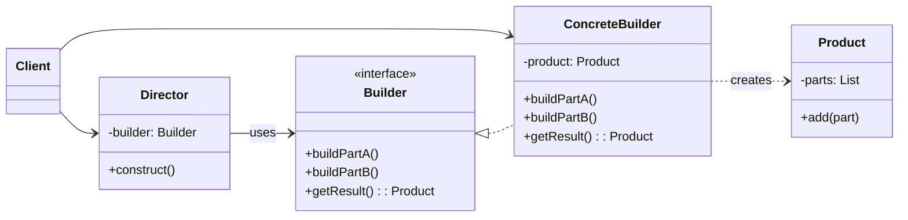

### 设计模式意图

**建造者模式 (Builder Pattern)** 旨在将一个复杂对象的构建过程与其表示分离，使得同样的构建过程可以创建不同的表示。它主要用于创建涉及多个步骤、配置复杂的对象。

### 类和方法解释

*   **`Client` (客户端)**
    *   作用：创建 `Director` 和 `ConcreteBuilder` 对象，并将 `ConcreteBuilder` 传递给 `Director`。最后从 `ConcreteBuilder` 中获取构建完成的复杂对象。
*   **`Director` (指挥者)**
    *   作用：负责安排复杂对象的构建步骤。它持有一个 `Builder` 接口的引用，并通过调用 `Builder` 的方法来指导构建过程。`Director` 隔离了客户端与具体构建过程。
    *   `construct()`: 按照预定的顺序调用 `Builder` 的构建方法（如 `buildPartA`, `buildPartB`）。
*   **`Builder` (抽象建造者)**
    *   角色：接口（`<<interface>>`）。
    *   作用：定义了创建产品各个部分所需的所有方法的抽象接口，以及一个返回最终产品的方法。
    *   `buildPartA()`: 构建产品的 A 部分。
    *   `buildPartB()`: 构建产品的 B 部分。
    *   `getResult(): Product`: 返回构建完成的复杂对象。
*   **`ConcreteBuilder` (具体建造者)**
    *   作用：实现了 `Builder` 接口，负责具体部件的构建和组装。它内部维护一个正在构建的产品实例。
    *   `getResult(): Product`: 返回其内部维护的产品实例。
*   **`Product` (产品)**
    *   作用：表示被构建的复杂对象。它通常由多个部分（`parts`）组成。
    *   `add(part)`: 向产品中添加一个部分。

### 关系解释

*   **`Director --> Builder : uses`**:
    *   关系：**关联 (Association)**，表示 "uses" 关系。
    *   解释：`Director` 持有一个 `Builder` 接口的引用。它通过这个接口来调用构建方法，而不知道具体的 `ConcreteBuilder` 是如何实现的。
*   **`Builder <|.. ConcreteBuilder`**:
    *   关系：**实现 (Realization)**。
    *   解释：`ConcreteBuilder` 是 `Builder` 接口的具体实现，提供了构建产品各个部分的具体逻辑。
*   **`ConcreteBuilder ..> Product : creates`**:
    *   关系：**依赖 (Dependency)**，表示创建关系。
    *   解释：`ConcreteBuilder` 负责创建并组装 `Product` 对象。
*   **`Client --> Director`** 和 **`Client --> ConcreteBuilder`**:
    *   关系：**关联 (Association)**。
    *   解释：客户端需要与 `Director` 和 `ConcreteBuilder` 进行交互，以启动整个构建过程并获取最终产品。