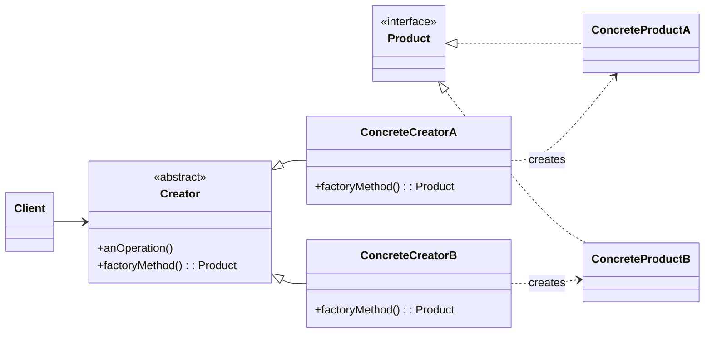

### 设计模式意图

**工厂方法模式 (Factory Method Pattern)** 定义了一个用于创建对象的接口，但让子类决定实例化哪一个类。工厂方法使一个类的实例化延迟到其子类。这使得代码在处理对象创建时，只依赖于抽象接口，而不是具体的实现类。

### 类和方法解释

*   **`Client` (客户端)**
    *   作用：需要一个产品对象，但它不直接创建，而是通过调用 `Creator` 的 `factoryMethod` 来获取。
*   **`Product` (抽象产品)**
    *   角色：接口 (`<<interface>>`)。
    *   作用：定义了工厂方法所创建的对象的通用接口。
*   **`ConcreteProductA` / `ConcreteProductB` (具体产品)**
    *   作用：实现了 `Product` 接口，是工厂方法实际创建的对象实例。
*   **`Creator` (抽象创建者)**
    *   角色：抽象类 (`<<abstract>>`) 或接口。
    *   作用：声明了工厂方法 `factoryMethod`，该方法返回一个 `Product` 类型的对象。它也可以定义一个调用工厂方法 `anOperation` 的默认实现。
    *   `factoryMethod(): Product`: 这是一个抽象方法，由子类实现来完成具体的对象创建。
    *   `anOperation()`: 依赖于 `factoryMethod` 来获取产品对象，并对产品进行操作。
*   **`ConcreteCreatorA` / `ConcreteCreatorB` (具体创建者)**
    *   作用：继承或实现 `Creator`，并重写 `factoryMethod` 方法，以返回一个具体的 `ConcreteProduct` 实例。

### 关系解释

*   **`Creator <|-- ConcreteCreatorA`** 和 **`Creator <|-- ConcreteCreatorB`**:
    *   关系：**继承/泛化 (Generalization)**。
    *   解释：`ConcreteCreatorA` 和 `ConcreteCreatorB` 是 `Creator` 的子类，它们提供了 `factoryMethod` 的具体实现。
*   **`Product <|.. ConcreteProductA`** 和 **`Product <|.. ConcreteProductB`**:
    *   关系：**实现 (Realization)**。
    *   解释：`ConcreteProductA` 和 `ConcreteProductB` 是 `Product` 接口的具体实现。
*   **`ConcreteCreatorA ..> ConcreteProductA : creates`**:
    *   关系：**依赖 (Dependency)**，表示创建关系。
    *   解释：`ConcreteCreatorA` 的 `factoryMethod` 负责创建 `ConcreteProductA` 的实例。
*   **`Client --> Creator`**:
    *   关系：**关联 (Association)**。
    *   解释：客户端与抽象的 `Creator` 交互，而不是其具体子类。这实现了客户端与具体产品创建过程的解耦。
