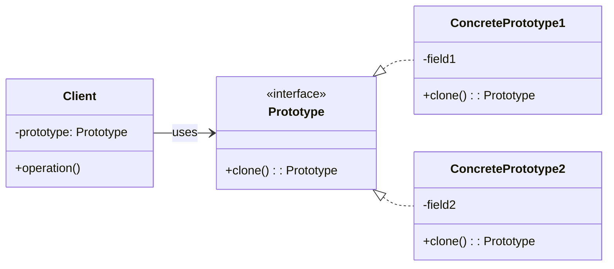

### 设计模式意图

**原型模式 (Prototype Pattern)** 用原型实例指定创建对象的种类，并且通过复制这些原型创建新的对象。当创建一个对象的成本非常大时（例如，需要复杂的计算或数据库查询），原型模式通过克隆现有对象来创建新对象，从而避免了高昂的创建成本。

### 类和方法解释

*   **`Client` (客户端)**
    *   作用：需要创建一个新对象时，它不通过 `new` 关键字来实例化，而是通过调用一个原型对象的 `clone()` 方法来获得一个副本，然后可以根据需要修改副本的属性。
    *   `operation()`: 在这个方法中，客户端会使用克隆出来的对象。
*   **`Prototype` (原型)**
    *   角色：接口 (`<<interface>>`) 或抽象类。
    *   作用：声明了一个用于克隆自身的接口。
    *   `clone(): Prototype`: 核心方法，用于复制当前对象并返回一个副本。
*   **`ConcretePrototype1` / `ConcretePrototype2` (具体原型)**
    *   作用：实现了 `Prototype` 接口，提供了具体的克隆逻辑。它们是可以被复制的实际对象。
    *   `field1`, `field2`: 这些是具体原型对象的内部状态（属性）。
    *   `clone(): Prototype`: 实现具体的复制逻辑，创建一个当前对象的新实例，并将其状态复制过去。

### 关系解释

*   **`Prototype <|.. ConcretePrototype1`** 和 **`Prototype <|.. ConcretePrototype2`**:
    *   关系：**实现 (Realization)**。
    *   解释：`ConcretePrototype1` 和 `ConcretePrototype2` 是 `Prototype` 接口的具体实现，它们必须提供 `clone` 方法的具体逻辑。
*   **`Client --> Prototype : uses`**:
    *   关系：**关联 (Association)**，表示 "uses" 关系。
    *   解释：客户端持有一个对抽象 `Prototype` 接口的引用。它通过这个接口来克隆对象，而无需关心具体是哪种 `ConcretePrototype`。这使得客户端与具体对象的类解耦。