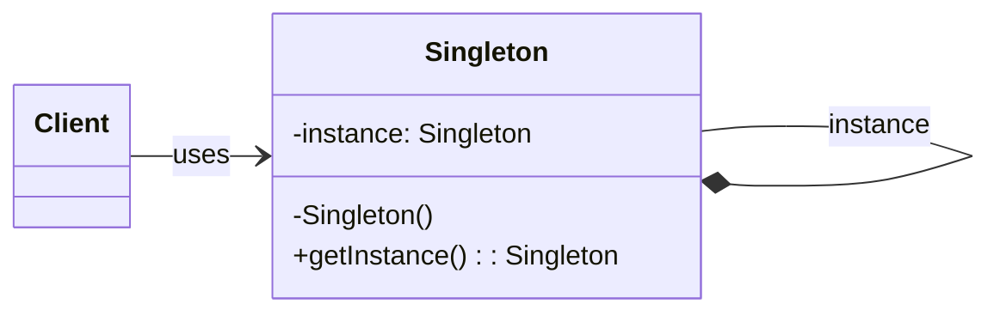

### 设计模式意图

**单例模式 (Singleton Pattern)** 确保一个类只有一个实例，并提供一个全局访问点来获取这个实例。它常用于那些逻辑上只需要一个实例的场景，例如线程池、缓存、日志对象、数据库连接池等。

### 类和方法解释

*   **`Client` (客户端)**
    *   作用：需要使用 `Singleton` 类的唯一实例。它不通过 `new` 关键字创建对象，而是通过调用 `Singleton.getInstance()` 方法来获取。
*   **`Singleton` (单例类)**
    *   作用：负责创建自己的唯一实例，并提供一个静态方法让外部可以访问这个实例。
    *   `-instance: Singleton`: 一个私有的静态成员变量，用于持有类的唯一实例。
    *   `-Singleton()`: 构造函数是私有的 (`private`)，这样可以防止外部代码通过 `new` 关键字直接创建实例。
    *   `+getInstance(): Singleton`: 一个公有的静态方法，是获取该类唯一实例的全局访问点。它会检查 `instance` 是否已经被创建，如果没有，则创建并返回；如果已经存在，则直接返回。

### 关系解释

*   **`Singleton --* Singleton : instance`**:
    *   关系：**组合 (Composition)** 或 **关联 (Association)**，这里表示自我引用。
    *   解释：`Singleton` 类内部持有一个对自己类型的静态引用 `instance`。这个引用指向它自身唯一的实例。
*   **`Client --> Singleton : uses`**:
    *   关系：**依赖 (Dependency)** 或 **关联 (Association)**，表示 "uses" 关系。
    *   解释：客户端依赖于 `Singleton` 类。它通过调用 `getInstance()` 静态方法来访问单例实例，而不是通过常规的实例化方式。