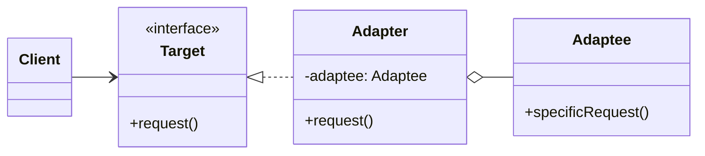

### 设计模式意图

**适配器模式 (Adapter Pattern)** 将一个类的接口转换成客户端所期望的另一个接口。它使得原本由于接口不兼容而不能一起工作的类可以协同工作。这种模式通常用于集成现有或第三方组件。

### 类和方法解释

*   **`Client` (客户端)**
    *   作用：与一个符合 `Target` 接口的对象进行交互。它不知道也不关心底层的 `Adaptee` 类。
*   **`Target` (目标接口)**
    *   角色：接口 (`<<interface>>`)。
    *   作用：定义了客户端所期望使用的接口。
    *   `request()`: 客户端调用的标准方法。
*   **`Adaptee` (被适配者)**
    *   作用：一个已经存在的类，但它的接口（例如 `specificRequest`）与 `Target` 接口不兼容。这是需要被适配的类。
    *   `specificRequest()`: `Adaptee` 自身特有的方法，无法被 `Client` 直接使用。
*   **`Adapter` (适配器)**
    *   作用：核心角色。它实现了 `Target` 接口，并且内部持有一个 `Adaptee` 对象的引用。当客户端调用 `Adapter` 的 `request()` 方法时，`Adapter` 会将这个调用转换为对 `Adaptee` 的 `specificRequest()` 方法的调用。
    *   `request()`: 实现了 `Target` 接口的方法。其内部实现会调用 `adaptee.specificRequest()`。

### 关系解释

*   **`Target <|.. Adapter`**:
    *   关系：**实现 (Realization)**。
    *   解释：`Adapter` 类实现了 `Target` 接口，这意味着它对外表现得像一个 `Target` 类型的对象，可以被客户端正常使用。
*   **`Adapter o-- Adaptee`**:
    *   关系：**聚合 (Aggregation)** 或 **关联 (Association)**。
    *   解释：`Adapter` 内部持有一个对 `Adaptee` 实例的引用。这是对象适配器模式的典型实现方式（另一种是类适配器，使用继承）。通过这个引用，`Adapter` 可以在自己的方法中调用 `Adaptee` 的方法。
*   **`Client --> Target`**:
    *   关系：**关联 (Association)**。
    *   解释：客户端依赖于抽象的 `Target` 接口，而不是具体的 `Adapter` 或 `Adaptee`。这使得客户端代码与具体的实现细节解耦。