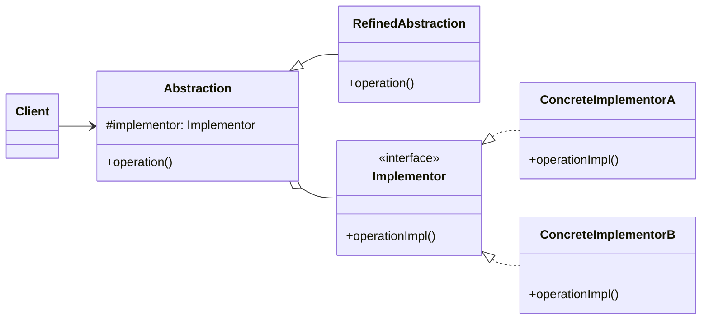

### 设计模式意图

**桥接模式 (Bridge Pattern)** 将抽象部分与它的实现部分分离，使它们都可以独立地变化。当一个类存在两个或多个独立变化的维度时，使用桥接模式可以避免产生一个庞大的类继承体系。

### 类和方法解释

*   **`Client` (客户端)**
    *   作用：与 `Abstraction` 对象交互，同时决定使用哪个 `ConcreteImplementor` 来完成具体工作。
*   **`Abstraction` (抽象)**
    *   作用：定义了高层控制逻辑的抽象接口。它内部维护一个对 `Implementor` 接口的引用。
    *   `#implementor: Implementor`: 持有实现部分的引用。
    *   `operation()`: 高层逻辑方法。它会调用 `implementor` 的 `operationImpl()` 方法来完成具体实现。
*   **`RefinedAbstraction` (精确抽象)**
    *   作用：继承自 `Abstraction`，可以扩展或实现更具体的业务逻辑，但仍然通过 `Implementor` 接口来调用底层实现。
*   **`Implementor` (实现者)**
    *   角色：接口 (`<<interface>>`)。
    *   作用：定义了底层实现的接口，供 `Abstraction` 调用。这个接口不关心高层业务逻辑。
    *   `operationImpl()`: 底层实现方法的抽象定义。
*   **`ConcreteImplementorA` / `ConcreteImplementorB` (具体实现者)**
    *   作用：实现了 `Implementor` 接口，提供了具体的底层操作。

### 关系解释

*   **`Abstraction <|-- RefinedAbstraction`**:
    *   关系：**继承/泛化 (Generalization)**。
    *   解释：`RefinedAbstraction` 扩展了 `Abstraction`，形成了抽象部分的继承体系。这个维度可以独立变化。
*   **`Implementor <|.. ConcreteImplementorA`** 和 **`Implementor <|.. ConcreteImplementorB`**:
    *   关系：**实现 (Realization)**。
    *   解释：`ConcreteImplementorA` 和 `ConcreteImplementorB` 是 `Implementor` 接口的具体实现，形成了实现部分的继承体系。这个维度也可以独立变化。
*   **`Abstraction o-- Implementor`**:
    *   关系：**聚合 (Aggregation)** 或 **组合 (Composition)**。
    *   解释：这是桥接模式的核心。`Abstraction` 对象包含一个对 `Implementor` 对象的引用。它将自身的行为委托给 `Implementor` 对象来完成，从而将抽象与实现解耦。
*   **`Client --> Abstraction`**:
    *   关系：**关联 (Association)**。
    *   解释：客户端只与 `Abstraction` 接口交互，无需关心底层的具体实现是 `ConcreteImplementorA` 还是 `ConcreteImplementorB`。