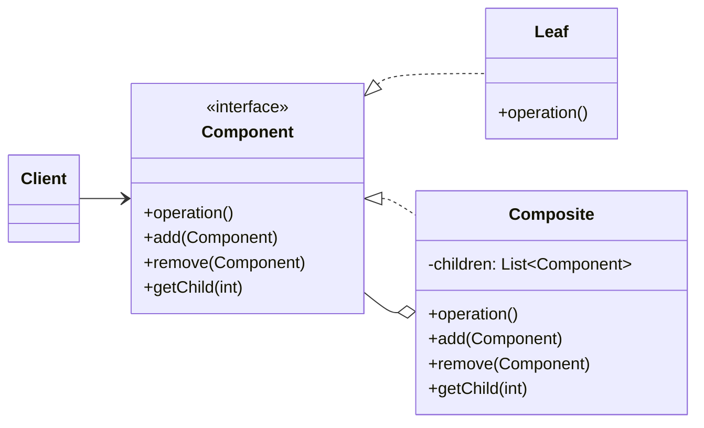

### 设计模式意图

**组合模式 (Composite Pattern)** 将对象组合成树形结构以表示“部分-整体”的层次结构。组合模式使得客户端对单个对象（叶子节点）和组合对象（容器节点）的使用具有一致性。

### 类和方法解释

*   **`Client` (客户端)**
    *   作用：通过 `Component` 接口与组合结构中的对象进行交互，无需区分它是叶子节点还是组合节点。
*   **`Component` (组件)**
    *   角色：接口 (`<<interface>>`) 或抽象类。
    *   作用：为组合中的所有对象（叶子和组合）定义一个统一的接口。
    *   `operation()`: 叶子和组合都需实现的操作。
    *   `add(Component)`, `remove(Component)`, `getChild(int)`: 用于管理子组件的方法。在 `Leaf` 中通常为空实现或抛出异常，因为叶子节点没有子节点。
*   **`Leaf` (叶子节点)**
    *   作用：表示组合结构中的末端对象，它没有子节点。
    *   `operation()`: 实现 `Component` 接口定义的操作。
*   **`Composite` (组合节点/容器)**
    *   作用：表示有子节点的组件。它存储子组件，并实现了在子组件上进行操作的方法。
    *   `-children: List<Component>`: 用于存储子组件的集合。
    *   `operation()`: 实现 `Component` 接口的操作，通常它的实现会遍历所有子组件并调用它们的 `operation()` 方法。
    *   `add`, `remove`, `getChild`: 实现了对子组件的管理。

### 关系解释

*   **`Component <|.. Leaf`** 和 **`Component <|.. Composite`**:
    *   关系：**实现 (Realization)**。
    *   解释：`Leaf` 和 `Composite` 都实现了统一的 `Component` 接口，这使得客户端可以一致地对待它们。
*   **`Composite o-- Component`**:
    *   关系：**聚合 (Aggregation)** 或 **组合 (Composition)**。
    *   解释：`Composite` 对象包含一组 `Component` 类型的子对象。这些子对象既可以是 `Leaf`，也可以是其他的 `Composite`，从而形成了树形结构。
*   **`Client --> Component`**:
    *   关系：**关联 (Association)**。
    *   解释：客户端依赖于抽象的 `Component` 接口，而不是具体的 `Leaf` 或 `Composite` 类。这使得客户端代码可以统一处理所有节点，简化了客户端的逻辑。