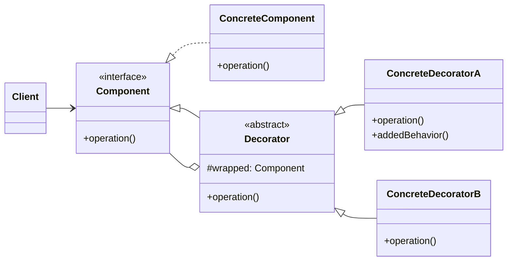

### 设计模式意图

**装饰器模式 (Decorator Pattern)** 动态地给一个对象添加一些额外的职责。就增加功能来说，装饰器模式相比生成子类更为灵活。它允许在运行时根据需要，透明地为对象添加或覆盖功能。

### 类和方法解释

*   **`Client` (客户端)**
    *   作用：与一个 `Component` 对象交互。它可以直接使用 `ConcreteComponent`，也可以使用被一个或多个装饰器包装后的对象，而无需改变代码。
*   **`Component` (组件)**
    *   角色：接口 (`<<interface>>`)。
    *   作用：定义了原始对象和装饰器对象的统一接口，确保客户端可以一致地处理它们。
    *   `operation()`: 核心业务方法。
*   **`ConcreteComponent` (具体组件)**
    *   作用：实现了 `Component` 接口，是需要被装饰的原始对象。
*   **`Decorator` (抽象装饰器)**
    *   角色：抽象类 (`<<abstract>>`)。
    *   作用：继承自 `Component`（或实现 `Component` 接口），并持有一个 `Component` 对象的引用。它的 `operation()` 方法通常会直接调用被包装对象的 `operation()` 方法。
    *   `#wrapped: Component`: 指向被包装的 `Component` 对象。
*   **`ConcreteDecoratorA` / `ConcreteDecoratorB` (具体装饰器)**
    *   作用：继承自 `Decorator`，负责向 `Component` 对象添加新的职责。
    *   `operation()`: 在调用被包装对象 `wrapped.operation()` 的前后，添加自己的额外操作。
    *   `addedBehavior()`: 装饰器可以添加全新的方法。

### 关系解释

*   **`Component <|.. ConcreteComponent`**:
    *   关系：**实现 (Realization)**。
    *   解释：`ConcreteComponent` 是 `Component` 接口的一个具体实现。
*   **`Component <|-- Decorator`**:
    *   关系：**继承/泛化 (Generalization)** 或 **实现 (Realization)**。
    *   解释：`Decorator` 也遵循 `Component` 的接口，这使得它可以替代 `ConcreteComponent`，让装饰器本身也可以被再次装饰。
*   **`Decorator <|-- ConcreteDecoratorA`** 和 **`Decorator <|-- ConcreteDecoratorB`**:
    *   关系：**继承/泛化 (Generalization)**。
    *   解释：具体的装饰器类继承自抽象装饰器，并添加特定的功能。
*   **`Decorator o-- Component`**:
    *   关系：**聚合 (Aggregation)** 或 **组合 (Composition)**。
    *   解释：这是装饰器模式的核心。每个 `Decorator` 对象都“包装”了一个 `Component` 对象（这个对象可能是 `ConcreteComponent` 或另一个 `Decorator`）。
*   **`Client --> Component`**:
    *   关系：**关联 (Association)**。
    *   解释：客户端代码只依赖于 `Component` 接口，因此它既可以与未经装饰的 `ConcreteComponent` 一起工作，也可以与层层装饰后的对象一起工作，而无需任何改变。