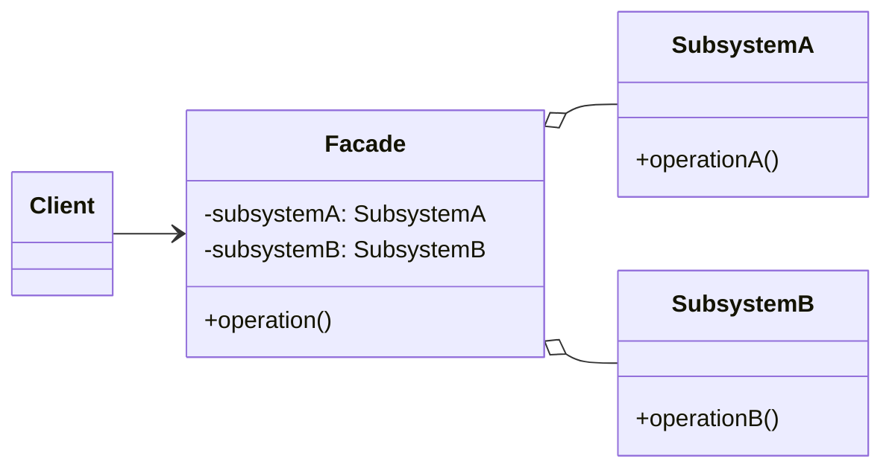

### 设计模式意图

**外观模式 (Facade Pattern)** 为子系统中的一组接口提供一个统一的高层接口，使得子系统更容易使用。它定义了一个高层接口，这个接口将客户端与子系统的复杂性隔离开来。

### 类和方法解释

*   **`Client` (客户端)**
    *   作用：需要与复杂的子系统进行交互，但它不直接调用子系统内部的多个类，而是通过调用 `Facade` 提供的简单接口来完成任务。
*   **`Facade` (外观)**
    *   作用：核心角色。它知道哪些子系统类负责处理请求，并将客户端的请求委托给适当的子系统对象。它封装了子系统的复杂性。
    *   `-subsystemA: SubsystemA`, `-subsystemB: SubsystemB`: 持有对子系统中各个组件的引用。
    *   `operation()`: 提供给客户端的简化接口。该方法的实现会协调调用 `SubsystemA` 和 `SubsystemB` 中的多个方法来完成一个复杂的任务。
*   **`SubsystemA` / `SubsystemB` (子系统类)**
    *   作用：实现子系统的具体功能。它们处理由 `Facade` 对象指派的任务，但对 `Facade` 一无所知，即它们没有对外观的引用。

### 关系解释

*   **`Facade o-- SubsystemA`** 和 **`Facade o-- SubsystemB`**:
    *   关系：**聚合 (Aggregation)** 或 **关联 (Association)**。
    *   解释：`Facade` 对象持有对一个或多个子系统类的引用。`Facade` 通过这些引用来调用子系统的功能。
*   **`Client --> Facade`**:
    *   关系：**关联 (Association)**。
    *   解释：客户端只与 `Facade` 接口进行交互。这大大简化了客户端的代码，并使客户端与子系统的内部实现解耦。如果子系统内部发生变化，只要 `Facade` 的接口不变，客户端代码就无需修改。