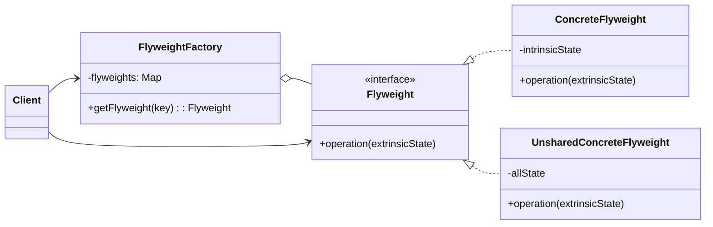

### 设计模式意图

**享元模式 (Flyweight Pattern)** 运用共享技术来有效地支持大量细粒度的对象。它通过共享不变的部分（内部状态）来减少内存消耗，并将可变的部分（外部状态）作为参数传递给方法。

### 类和方法解释

*   **`Client` (客户端)**
    *   作用：需要使用大量的 `Flyweight` 对象。它不直接创建，而是通过 `FlyweightFactory` 来获取。客户端负责维护和传递外部状态（`extrinsicState`）给 `Flyweight` 对象。
*   **`FlyweightFactory` (享元工厂)**
    *   作用：创建并管理享元对象。它维护一个池（`flyweights`），用于存储已经创建的享元。
    *   `getFlyweight(key)`: 当客户端请求一个享元时，工厂会检查池中是否已存在具有相同 `key` 的享元。如果存在，则返回共享的实例；如果不存在，则创建一个新的实例，存入池中，然后返回。
*   **`Flyweight` (抽象享元)**
    *   角色：接口 (`<<interface>>`)。
    *   作用：定义了享元对象的公共接口，客户端通过这个接口与享元对象交互。
    *   `operation(extrinsicState)`: 享元对象执行操作的方法。它接收外部状态作为参数，这些状态在每次调用时都可能不同。
*   **`ConcreteFlyweight` (具体享元)**
    *   作用：实现了 `Flyweight` 接口，是可被共享的对象。
    *   `-intrinsicState`: 内部状态。这是存储在 `ConcreteFlyweight` 内部的、不随上下文改变的数据。所有共享该对象的客户端看到的内部状态都是一样的。
*   **`UnsharedConcreteFlyweight` (非共享具体享元)**
    *   作用：不是所有 `Flyweight` 子类都需要被共享。这个类表示那些不能被共享的享元对象，客户端可以直接创建它们，而无需通过工厂。
    *   `-allState`: 它包含了所有状态，没有内外之分。

### 关系解释

*   **`Flyweight <|.. ConcreteFlyweight`** 和 **`Flyweight <|.. UnsharedConcreteFlyweight`**:
    *   关系：**实现 (Realization)**。
    *   解释：`ConcreteFlyweight` 和 `UnsharedConcreteFlyweight` 都是 `Flyweight` 接口的具体实现。
*   **`FlyweightFactory o-- Flyweight`**:
    *   关系：**聚合 (Aggregation)**。
    *   解释：`FlyweightFactory` 内部管理着一个 `Flyweight` 对象的集合（池）。
*   **`Client --> FlyweightFactory`**:
    *   关系：**关联 (Association)**。
    *   解释：客户端通过工厂来获取享元对象，而不是直接实例化。
*   **`Client --> Flyweight`**:
    *   关系：**关联 (Association)**。
    *   解释：客户端持有并使用从工厂获取的 `Flyweight` 对象。