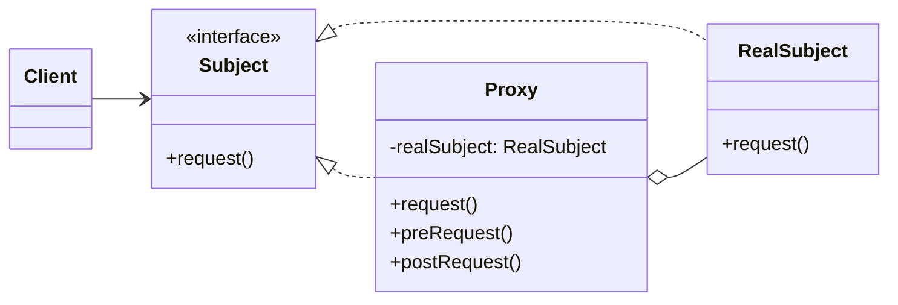

### 设计模式意图

**代理模式 (Proxy Pattern)** 为其他对象提供一种代理以控制对这个对象的访问。代理对象在客户端和目标对象之间起到中介的作用，可以附加额外的功能，如访问控制、延迟加载、日志记录等。

### 类和方法解释

*   **`Client` (客户端)**
    *   作用：需要访问 `RealSubject` 对象的功能，但它不直接与 `RealSubject` 交互，而是通过 `Subject` 接口与 `Proxy` 对象通信。
*   **`Subject` (主题)**
    *   角色：接口 (`<<interface>>`)。
    *   作用：定义了 `RealSubject` 和 `Proxy` 的共同接口。这使得 `Proxy` 可以在任何需要 `RealSubject` 的地方被使用。
    *   `request()`: 客户端请求执行的操作。
*   **`RealSubject` (真实主题)**
    *   作用：定义了 `Proxy` 所代表的真实实体。它是最终执行业务逻辑的对象。
*   **`Proxy` (代理)**
    *   作用：实现了 `Subject` 接口，使得它可以替代 `RealSubject`。它内部持有一个对 `RealSubject` 的引用。
    *   `-realSubject: RealSubject`: 指向它所代理的真实对象的引用。
    *   `request()`: 实现了 `Subject` 的方法。它在将请求转发给 `realSubject` 之前或之后，可以执行一些附加操作（如 `preRequest`, `postRequest`）。
    *   `preRequest()` / `postRequest()`: 代理对象可以添加的额外逻辑，例如权限检查、日志记录、缓存处理等。

### 关系解释

*   **`Subject <|.. RealSubject`** 和 **`Subject <|.. Proxy`**:
    *   关系：**实现 (Realization)**。
    *   解释：`RealSubject` 和 `Proxy` 都实现了相同的 `Subject` 接口。这使得 `Proxy` 能够完全替代 `RealSubject`，客户端无需关心与之交互的到底是真实对象还是代理对象。
*   **`Proxy o-- RealSubject`**:
    *   关系：**聚合 (Aggregation)** 或 **关联 (Association)**。
    *   解释：`Proxy` 对象持有一个对 `RealSubject` 对象的引用。当客户端调用 `Proxy` 的 `request` 方法时，`Proxy` 会将这个请求委托给 `RealSubject` 来处理。
*   **`Client --> Subject`**:
    *   关系：**关联 (Association)**。
    *   解释：客户端只依赖于 `Subject` 接口。它与接口交互，而不知道具体实现是 `RealSubject` 还是 `Proxy`。这实现了客户端与真实对象的解耦。